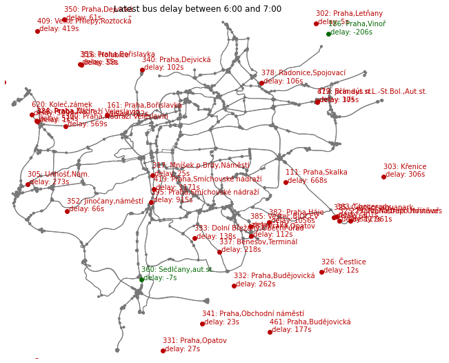
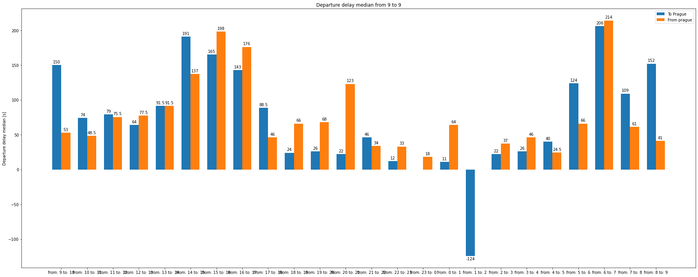
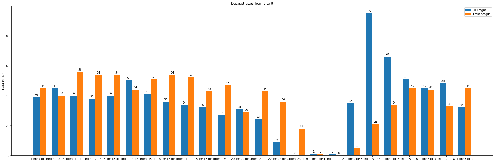

# CTU FEE BDT course homework

Main script is a Databricks notebook located in `notebook/analyze-traffic.py`

> ## 4 - Differences by direction of travel - to and from Prague
>
> From the data stream, implement a stream processing application that will calculate
> differences in delay for suburban lines - arrival and departure delays.
>
> Input: stream
> Output: Dashboard map with arrivals to Prague and marking the differences in delays during
> the day

### Data retrieval

- The `req-buses` topic was read each hour over cca 1 day
- Only bus lines from/to Prague are used
- Only the latest entry per each hour is selected

### Plots

Map containing latest bus positions with their direction and delay (red ones are delayed, green ones are on time)

#### Bar plots showing differences between delays of buses heading from/to Prague over 24-hour period

